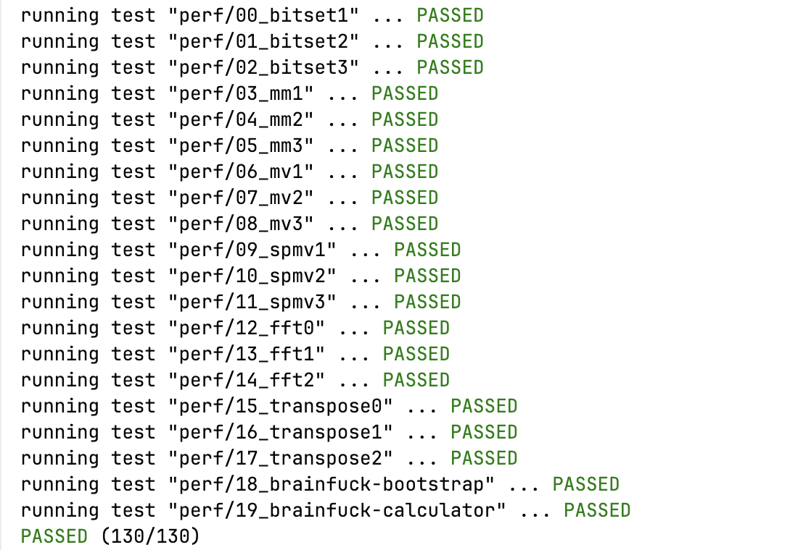

# PKU Compiler Lab
北大编译原理实验  

doc:https://pku-minic.github.io/online-doc/#/  

## 分支说明

- master: 记录了lab0-lab9的所有提交记录
- lab8  : 记录了能处理至lab8内容的编译器

> 为什么要单独记录lab8?  
> 答: lab9新增支持**数组**与**数组参数**相关内容, 个人认为难度相较于前面所有lab有较大跨度  
> 且在lab9频繁借助AI编码, 代码质量不敢保证
> 
> 对于lab8, 编译器已可以支持**表达式, 常量与变量, 分支流程控制, 函数**等功能  
> 且整体难度相对较低易于理解, 故单独记录并进行一些思路分享(见该分支README)  


## 实验结构

- [x] lab0: koopaIR库常用接口
- [x] lab1: 简单表达式koopaIR生成
- [x] lab2: 简单表达式riscv生成
- [x] lab3: 表达式(一元表达式, 算术表达式, 逻辑表达式)
- [x] lab4: 常量与变量
- [x] lab5: 语句块和作用域
- [x] lab6: if语句
- [x] lab7: while语句
- [x] lab8: 函数与全局变量
- [x] lab9: 数组

## 自测运行

> 请先根据实验文档配置本地docker环境  
```shell

# 本地运行命令
cargo run -- -koopa hello.c -o koopair.txt
cargo run -- -riscv hello.c -o riscv.txt

# 本地测试命令
docker run -it --rm -v ./:/root/compiler maxxing/compiler-dev autotest -koopa -s lv${LEVEL} /root/compiler
docker run -it --rm -v ./:/root/compiler maxxing/compiler-dev autotest -riscv -s lv${LEVEL} /root/compiler

# 全case测试
docker run -it --rm -v ./:/root/compiler maxxing/compiler-dev autotest -koopa /root/compiler
docker run -it --rm -v ./:/root/compiler maxxing/compiler-dev autotest -riscv /root/compiler
```
  
